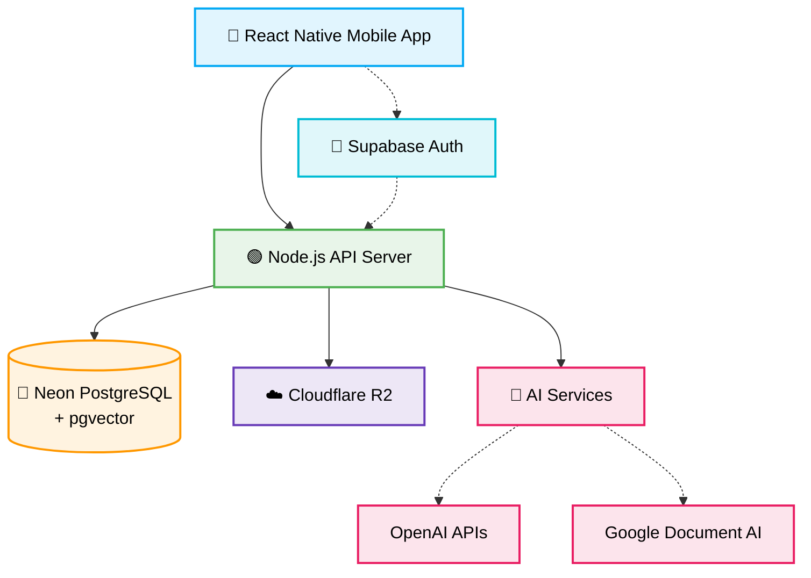

<div align="center">

# 🧠 UNIMIND

### 🚀 The AI-Powered Academic Operating System for Universities

[](LICENSE)
[](#)
[](#contributing)

*Not just a note-sharing app, a PDF archive, or an AI chatbot.*  
**UNIMIND is a comprehensive University-specific AI Learning Infrastructure.**  
An intelligent ecosystem where AI understands your syllabus, resources, exam patterns, and learning gaps.

[**Getting Started**](#-getting-started) · [**Roadmap**](#-complete-feature-roadmap) · [**Tech Stack**](#-technology-stack) · [**Contributing**](#-contributing)

---

</div>

## 📖 Table of Contents

- [✨ Vision](#-vision)
- [🔥 The Problem](#-the-problem-we-are-solving)
- [💡 The Solution](#-the-solution)
- [📋 Complete Feature Roadmap](#-complete-feature-roadmap)
  - [🟢 Phase 1: MVP Core](#-phase-1--mvp-core-launch-ready)
  - [🔵 Phase 2: Intelligence Layer](#-phase-2--intelligence-layer)
  - [🟡 Phase 3: Community & Collaboration](#-phase-3--community--collaboration)
  - [🟠 Phase 4: Research & Advanced AI](#-phase-4--research--advanced-ai)
  - [🔴 Phase 5: Platform & Ecosystem](#-phase-5--platform--ecosystem-scale)
- [🛠 Technology Stack](#-technology-stack)
- [🏗 Architecture Overview](#-architecture-overview)
- [🚀 Getting Started](#-getting-started)
- [🤝 Contributing](#-contributing)
- [📄 License](#-license)

---

## ✨ Vision

> **"A single intelligent platform where every university student can find, understand, and master their academics — powered by AI that knows their exact curriculum."**

UNIMIND transforms scattered, passive study materials into an **active, intelligent, and personalized tutoring ecosystem**. By combining Semantic Search, OCR, LLMs, and academic analytics, it delivers a 24/7 AI tutor tailored to the exact curriculum of each institution.

---

## 🔥 The Problem We Are Solving

| 🚨 Pain Point | 📉 Reality |
|:---|:---|
| **Scattered Notes** | Resources are spread across Facebook groups, Google Drives, random PDFs, and personal collections. |
| **Broken Discovery** | Finding the *right* resource for a *specific* topic is a frustrating treasure hunt. |
| **No Structured Exam Prep** | Students have no systematic way to analyze past papers or identify high-probability topics. |
| **Generic AI** | Tools like ChatGPT have zero context about a specific university's syllabus or exam style. |
| **Invisible Weak Spots** | Students can't objectively identify which topics they're weakest in until it's too late. |
| **Unverified Quality** | There's no mechanism to distinguish excellent notes from mediocre ones. |

---

## 💡 The Solution

**UNIMIND** addresses every layer of the student academic lifecycle:

```text
┌─────────────────────────────────────────────────────────────────┐
│                       🌟 UNIMIND ECOSYSTEM                      │
├──────────────────────┬──────────────────────┬───────────────────┤
│     🔍 DISCOVER      │    🧠 UNDERSTAND     │     🏆 MASTER     │
├──────────────────────┼──────────────────────┼───────────────────┤
│ • Smart Search       │ • 24/7 AI Tutor      │ • PQ Analyzer     │
│ • Note Storage       │ • Smart Summaries    │ • Weak Detection  │
│ • OCR Engine         │ • Auto Flashcards    │ • Practice Tests  │
│ • Peer Ratings       │ • Custom Study Paths │ • Perf. Dashboard │
└──────────────────────┴──────────────────────┴───────────────────┘
```

---

## 📋 Complete Feature Roadmap

### 🟢 Phase 1 — MVP Core (Launch-Ready)
*The foundation: content ingestion, organization, and basic AI intelligence.*

- [ ] **Academic Feed:** Facebook-style study feed showing trending notes and new uploads.
- [ ] **University-wise Note Storage:** Structured repository (University → Department → Course → Topic).
- [ ] **Department-wise Resource Management:** Granular organization and access control.
- [ ] **PDF/DOCX Note Reader:** In-app reader with smooth rendering.
- [ ] **OCR-Based Note Extraction:** Convert handwritten notes into searchable text.
- [ ] **Semantic Search System:** Natural language vector search *inside* content.
- [ ] **Handwriting Recognition Search:** Search handwritten notes via OCR.
- [ ] **Student Review & Rating System:** Crowdsourced quality control.
- [ ] **Note Quality Scoring System:** Algorithmic scoring (ratings + downloads + AI).
- [ ] **Topic-wise Resource Organization:** Fine-grained tagging.
- [ ] **Cloud-based File Storage:** Secure, scalable storage for materials.
- [ ] **Video Explanation Uploads:** Support for short video explanations.

### 🔵 Phase 2 — Intelligence Layer
*AI-powered learning, exam prep, and personalized analytics.*

- [ ] **AI-Based Tutor System:** Conversational AI contextualized on course materials.
- [ ] **AI Structured Note & Summary Gen:** Auto-generate notes and summaries.
- [ ] **AI Quiz & Flashcard Generator:** Auto-create MCQs and spaced-repetition cards.
- [ ] **AI Exam Prep & PQ Analysis:** Analyze past papers for patterns and important topics.
- [ ] **Weak Topic Detection:** Identify weak areas based on quiz performance.
- [ ] **Personal Academic Analytics:** Visual overview of progress and readiness.
- [ ] **Note Highlight & Annotation:** In-app highlighting on any document.
- [ ] **Mock Test & Study Roadmap Gen:** Full mock exams and personalized timelines.
- [ ] **Smart Recommendation & Mastery Tracking:** Intelligent content suggestions and topic mastery levels.

### 🟡 Phase 3 — Community & Collaboration
*Social learning, verified contributors, and university-specific communities.*

- [ ] **University & Batch Chat Systems:** Real-time messaging with AI-assisted replies.
- [ ] **Trusted Contributor & Alumni Systems:** Verified badges and mentorship.
- [ ] **Gamified Learning:** Points, badges, streaks, and leaderboards.
- [ ] **University-specific Communities:** Dedicated spaces with forums and polls.
- [ ] **Past Paper Archive & Syllabus Integration:** Curated archives aligned with curricula.
- [ ] **Teacher & Official Resource Verification:** Badges for official materials.
- [ ] **Content Moderation Pipeline:** AI + human moderation for quality control.

### 🟠 Phase 4 — Research & Advanced AI
*Academic research support, thesis assistance, and deep AI capabilities.*

- [ ] **AI Academic & Research Assistant:** Brainstorming, lit review, and paper summarization.
- [ ] **Citation & Thesis Checker:** Auto-citations and structural completeness checks.
- [ ] **Logical Error & Research Gap Detection:** Advanced writing and research analysis.
- [ ] **AI Slide Generator & Knowledge Retrieval (RAG):** Auto-presentations and source-grounded responses.
- [ ] **Knowledge Graph & Topic Mapping:** Visual maps connecting concepts across courses.
- [ ] **University-specific AI Knowledgebase:** Fine-tuned models per institution.

### 🔴 Phase 5 — Platform & Ecosystem (Scale)
*Multi-university expansion, admin tooling, and enterprise-grade infrastructure.*

- [ ] **Multi-University Ecosystem:** Single platform, isolated data and branding.
- [ ] **University & Department Admin Panels:** Granular administrative controls.
- [ ] **White-label Platform & LMS Integration:** Custom deployments and LMS connectors.
- [ ] **Community-driven Knowledgebase:** Wiki-style collaborative repositories.
- [ ] **Complete AI Academic OS:** The full vision realized at scale.

---

## 🛠 Technology Stack

<div align="center">
  
  
  
  
  
  
  
</div>

<br/>

| Layer | Technology | Rationale |
|-------|-----------|-----------|
| **Frontend** | React Native | Cross-platform mobile (iOS + Android) from a single codebase |
| **Backend** | Node.js | Fast iteration, excellent async handling for AI API calls |
| **Primary Database** | Neon PostgreSQL | Serverless, scalable relational database |
| **Authentication** | Supabase Auth | Battle-tested auth with social login, magic links, and RLS |
| **File Storage** | Cloudflare R2 | S3-compatible storage with zero egress fees — critical for media |
| **AI Engine** | OpenAI APIs | GPT models for tutoring, summarization, and content generation |
| **Semantic Search** | pgvector | Vector similarity search directly in PostgreSQL |
| **OCR / Document AI** | Google Document AI | Best-in-class extraction for handwritten notes and scans |

---

## 🏗 Architecture Overview



---

## 🚀 Getting Started

> 🚧 **UNIMIND is currently in the early development phase.** Setup instructions will be added as the project matures.

### Prerequisites

- **Node.js** >= 18.x
- **npm** or **yarn**
- **React Native CLI**
- **PostgreSQL** (or Neon account)
- **OpenAI API Key**
- **Google Cloud account** (for Document AI)

### Installation

```bash
# 1. Clone the repository
git clone https://github.com/AdnanShahria/UniMind.git
cd UniMind

# 2. Install dependencies
npm install

# 3. Set up environment variables
cp .env.example .env
# Fill in your API keys and database credentials

# 4. Start the development server
npm run dev
```

---

## 🤝 Contributing

We welcome contributions from developers, designers, and students! Here's how you can help:

1. **Fork** the repository
2. **Create** your feature branch (`git checkout -b feature/amazing-feature`)
3. **Commit** your changes (`git commit -m 'Add amazing feature'`)
4. **Push** to the branch (`git push origin feature/amazing-feature`)
5. **Open** a Pull Request

Please read our contributing guidelines before submitting PRs.

---

## 📄 License

This project is licensed under the **MIT License** — see the [LICENSE](LICENSE) file for details.

---

<div align="center">

### 🧠 UNIMIND
**AI-Powered Academic Operating System for Universities**

Built with ❤️ for students everywhere.  
*"Study Smarter, Not Harder."*

</div>